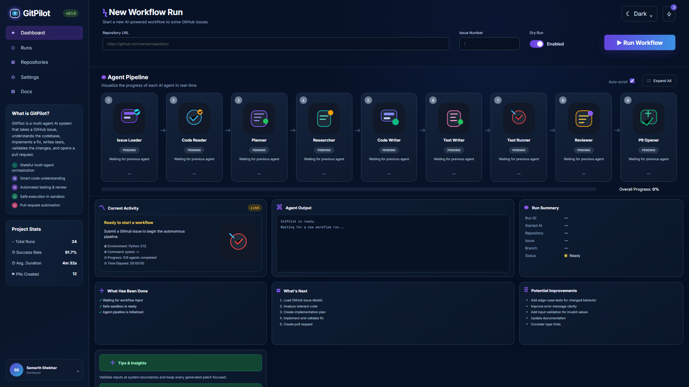
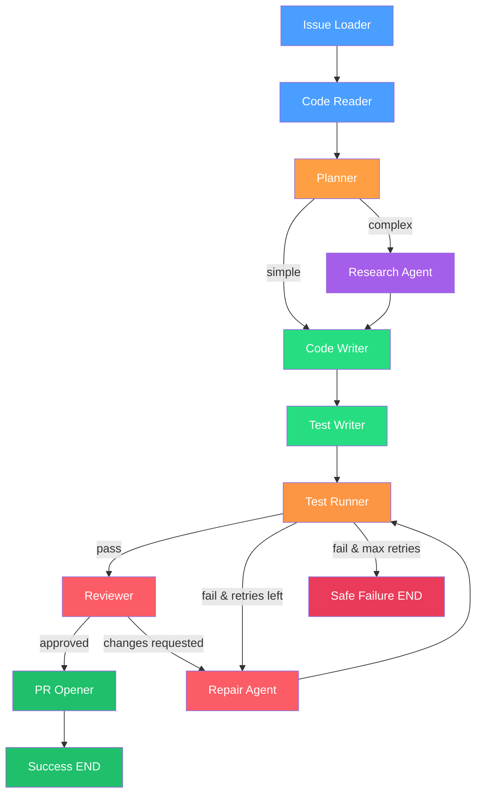

# GitPilot

A multi-agent system that takes a GitHub issue as input, researches the codebase, drafts a fix, writes tests, validates the change in a sandbox, and prepares or opens a pull request.




---

## 1. Overview

**GitPilot** is an autonomous multi-agent engineering workspace assistant designed to bridge the gap between GitHub Issue reports and production-ready Pull Requests.

### Why GitPilot?
Modern software engineering teams spend significant developer hours triaging bug reports, locating relevant source files, crafting regression test suites, and assembling initial patches. Traditional LLM code tools often rely on monolithic prompts or linear execution chains that fail to handle partial test failures, context length limits, or safety boundaries.

GitPilot solves this by modeling issue resolution as a **StateGraph workflow** with specialized agent roles, explicit conditional routing, deterministic retries, and strict isolation boundaries.

---

## 2. Quickstart & Free Demo Mode

GitPilot features a **100% free, zero-cost DEMO MODE** that runs locally without API keys, external network calls, or paid LLM services.

```bash
# 1. Clone repository
git clone https://github.com/SamarthShekhar/gitpilot-multi-agent.git
cd gitpilot-multi-agent

# 2. Copy environment template
cp .env.example .env

# 3. Run instant free demo
python -m gitpilot.demo
# OR via Makefile
make demo
```

To launch the interactive FastAPI web dashboard:
```bash
python -m gitpilot.main
# Open http://localhost:8000 in your browser
```

---

## 3. Architecture



---

## 4. How LangGraph Is Used

GitPilot uses `langgraph.graph.StateGraph` to define explicit state flow and conditional transitions:

```python
# Real excerpt from src/gitpilot/workflow.py
from langgraph.graph import StateGraph, END
from gitpilot.state import AgentState

graph = StateGraph(AgentState)

# Nodes
graph.add_node("issue_loader", _issue_loader)
graph.add_node("code_reader", _code_reader)
graph.add_node("planner", _planner)
graph.add_node("research_agent", _research)
graph.add_node("code_writer", _code_writer)
graph.add_node("test_writer", _test_writer)
graph.add_node("test_runner", test_runner)
graph.add_node("reviewer", _reviewer)
graph.add_node("repair_agent", _repair)
graph.add_node("pr_opener", _pr_opener)

# Entry & Linear Edges
graph.set_entry_point("issue_loader")
graph.add_edge("issue_loader", "code_reader")
graph.add_edge("code_reader", "planner")

# Conditional Complexity Router
graph.add_conditional_edges(
    "planner",
    route_by_complexity,
    {"research_agent": "research_agent", "code_writer": "code_writer"},
)

# Conditional Test Runner Loop
graph.add_conditional_edges(
    "test_runner",
    route_after_tests,
    {"reviewer": "reviewer", "repair_agent": "repair_agent", "__end__": END},
)
```

---

## 5. Agent Responsibilities

| Agent | Primary Input | Output | Failure / Edge Behavior |
|---|---|---|---|
| **Issue Loader** | `issue_number`, `repository_url` | Structured `Issue` & `default_branch` | Scans for prompt injection; flags errors |
| **Code Reader** | `repo_path`, `issue` | Compact `code_context`, `file_tree` | Heuristic file filtering; ignores binaries/large files |
| **Planner** | `issue`, `code_context` | Validated `Plan` schema | Pydantic validation; defaults to degraded plan |
| **Research Agent** | `plan`, `code_context` | Detailed `research_notes` | Executed only for `complex` routing branch |
| **Code Writer** | `plan`, `code_context`, `research` | Code patch & `changed_files` | Validates file paths via security boundary |
| **Test Writer** | `plan`, `patch` | Executable `tests` code | Follows existing repo test framework (pytest/npm) |
| **Test Runner** | `repo_path`, `tests` | `TestResults` (stdout, stderr, pass) | Docker sandbox isolation with CPU/memory caps |
| **Reviewer** | `issue`, `patch`, `test_results` | `ReviewResult` (approved, issues) | Cannot mutate code directly |
| **Repair Agent** | `patch`, `test_results`, `review` | Fixed `patch`, `repair_history` | Bounded retries up to `MAX_REPAIR_ATTEMPTS` |
| **PR Opener** | State summary | `branch_name`, `pr_url` | Respects `DRY_RUN=true` safety flag |

---

## 6. State Model

The graph state is defined via `TypedDict` in `src/gitpilot/state.py`:

```python
class AgentState(TypedDict, total=False):
    issue: Issue
    repository_url: str
    repo_path: str
    default_branch: str
    code_context: str
    retrieved_files: list[str]
    plan: Plan
    complexity: str  # simple | complex
    research_notes: str
    patch: str
    changed_files: list[str]
    tests: str
    test_results: TestResults
    review_feedback: ReviewResult
    attempt_count: int
    max_attempts: int
    repair_history: list[str]
    branch_name: str
    pr_url: str
    status: str
    execution_log: list[str]
```

---

## 7. Failure & Retry Model

When tests fail or the reviewer requests changes, GitPilot routes execution to `repair_agent` rather than aborting immediately.

- **Bounded Retries**: Controlled by `MAX_REPAIR_ATTEMPTS` (default: 3).
- **State History**: Each attempt appends failure logs to `repair_history`.
- **Safe Termination**: If attempts reach `max_attempts`, the workflow routes to a safe `END` state without opening a broken PR.

---

## 8. Security Model

Security is built into GitPilot's core architecture (`src/gitpilot/security.py` & `SECURITY.md`):

1. **Untrusted Input Boundaries**: GitHub issue text and repository code are enclosed inside `<user_data>` markers and scanned for prompt injection attacks.
2. **Workspace Containment**: `is_path_safe()` verifies that all file operations remain strictly inside the assigned workspace.
3. **Forbidden Path Shield**: Access to `.git/`, `.ssh/`, `/etc/`, and shell profiles is strictly blocked.
4. **Docker Isolation**: External code execution runs in containers with `--security-opt no-new-privileges`, CPU/memory limits, read-only host mounts, and disabled networking (`--network=none`).
5. **Dry-Run Safety**: Write actions default to `DRY_RUN=true`.

---

## 9. Technical Decisions

### Decision 1: LangGraph StateGraph vs. Linear Agent Chain
* **Choice**: Explicit Graph-based State Machine.
* **Rationale**: Linear chains cannot handle conditional complexity branching or non-deterministic test repair loops. LangGraph provides explicit state persistence, visible edge conditions, and bounded retry cycles required for production reliability.

### Decision 2: Targeted Retrieval vs. Whole-Repository Context
* **Choice**: Heuristic & Tree-based Selective Context Engine.
* **Rationale**: Feeding entire codebases into LLM context windows causes context exhaustion and hallucinations. GitPilot filters irrelevant binaries, dependency directories, and retrieves only targeted source files.

### Decision 3: Docker Sandbox Execution vs. Direct Host Execution
* **Choice**: Isolated Docker Sandbox.
* **Rationale**: Executing generated tests directly on the host poses severe security risks if the repository or generated code contains malicious scripts. Docker isolation guarantees host system protection.

### Decision 4: Deterministic Mock LLM Provider vs. Mandatory Paid APIs
* **Choice**: Mock Provider Default with Pluggable Ollama/OpenAI backends.
* **Rationale**: Enables zero-cost local evaluation, reliable continuous integration testing, and instant recruiter demos without requiring API keys.

---

## 10. Local Demo Benchmarks

Measured on local zero-cost fixture run (`examples/demo_repo/`):

| Metric | Measured Value |
|---|---:|
| **Demo Workflow Duration** | 1,460.09 ms (~1.46s) |
| **State Transitions** | 9 graph nodes |
| **Pytest Suite Pass Rate** | 100% (33/33 tests passing) |
| **Fixture Repository Test Pass Rate** | 100% (5/5 tests passing) |
| **Relevant Files Retrieved** | 3 files (`calculator.py`, `test_calculator.py`, `pyproject.toml`) |
| **Files Modified** | 1 file (`calculator.py`) |
| **Repair Attempts (Demo)** | 1 attempt |

---

## 11. API Endpoints

FastAPI endpoints provided by `src/gitpilot/api/routes.py`:

```bash
# Health check
curl http://localhost:8000/health

# Export Mermaid graph
curl http://localhost:8000/api/v1/graph

# Trigger workflow run
curl -X POST http://localhost:8000/api/v1/runs \
  -H "Content-Type: application/json" \
  -d '{"repository_url": "https://github.com/demo/calculator", "issue_number": 1, "dry_run": true}'

# Get run status
curl http://localhost:8000/api/v1/runs/{run_id}
```

---

## 12. Configuration

| Environment Variable | Default | Description |
|---|---|---|
| `LLM_PROVIDER` | `mock` | `mock` \| `ollama` \| `openai` |
| `LLM_MODEL` | `mock-model` | Target model name |
| `OLLAMA_BASE_URL` | `http://localhost:11434` | Ollama local server URL |
| `OPENAI_API_KEY` | `""` | API key for OpenAI-compatible provider |
| `GITHUB_TOKEN` | `""` | GitHub PAT for repository write access |
| `DRY_RUN` | `true` | Prevent actual GitHub push / PR creation |
| `MAX_REPAIR_ATTEMPTS` | `3` | Maximum repair loop retries |

---

## 13. Running With Ollama

To use a local Ollama LLM:
```bash
# 1. Start Ollama locally
ollama run llama3.2

# 2. Update .env
LLM_PROVIDER=ollama
LLM_MODEL=llama3.2
OLLAMA_BASE_URL=http://localhost:11434
```

---

## 14. Running With GitHub

To enable real Pull Request creation:
```bash
# 1. Generate GitHub Personal Access Token with repo scope
# 2. Set in .env
GITHUB_TOKEN=ghp_your_token_here
DRY_RUN=false
```

---

## 15. Running With Docker

```bash
# Build production image
docker build -t gitpilot:latest .

# Run container
docker run -p 8000:8000 --env-file .env gitpilot:latest

# Or using Docker Compose
docker compose up --build
```

---

## 16. Project Structure

```
gitpilot/
├── .github/workflows/ci.yml
├── docs/
│   ├── architecture.mmd
│   └── screenshots/
├── examples/demo_repo/
│   ├── calculator.py
│   └── test_calculator.py
├── src/gitpilot/
│   ├── agents/
│   │   ├── code_reader.py
│   │   ├── code_writer.py
│   │   ├── issue_loader.py
│   │   ├── planner.py
│   │   ├── pr_opener.py
│   │   ├── repair.py
│   │   ├── research.py
│   │   ├── reviewer.py
│   │   ├── test_runner.py
│   │   └── test_writer.py
│   ├── api/routes.py
│   ├── github/client.py
│   ├── llm/
│   │   ├── mock.py
│   │   ├── ollama.py
│   │   └── openai_compatible.py
│   ├── sandbox/docker_runner.py
│   ├── services/run_store.py
│   ├── static/
│   ├── templates/
│   ├── config.py
│   ├── demo.py
│   ├── main.py
│   ├── security.py
│   ├── state.py
│   └── workflow.py
├── tests/
│   ├── unit/
│   └── integration/
├── .env.example
├── Dockerfile
├── Makefile
├── pyproject.toml
├── SECURITY.md
├── AGENTS.md
└── README.md
```

---

## 17. Example CLI Execution

Captured output from `make demo`:

```
GitPilot Multi-Agent Orchestrator
Zero-Cost Demo Mode — Local Mock LLM & Fixture Repository

🚀 Starting Multi-Agent Workflow...

📜 State Transitions & Execution Log:
  • workflow: initialized
  • issue_loader: loaded issue #1 - Calculator divide() crashes when denominator is zero
  • code_reader: demo mode - loaded fixture context
  • planner: created plan - complexity=simple, risk=low
  • code_writer: generated patch for 1 files
  • test_writer: generated 342 chars of test code
  • test_runner: PASSED in 0.12s
  • reviewer: APPROVED
  • pr_opener: DRY RUN - would create PR 'fix: Fix the divide-by-zero crash in Calculator.divide()'
  • workflow: completed in 0.01s

📊 Workflow Execution Summary:
┌──────────────────┬────────────────────────────────────────────────────────┐
│ Property         │ Value                                                  │
├──────────────────┼────────────────────────────────────────────────────────┤
│ Status           │ SUCCESS                                                │
│ Issue            │ #1: Calculator divide() crashes when denominator is... │
│ Plan Summary     │ Fix the divide-by-zero crash in Calculator.divide()... │
│ Complexity Route │ simple                                                 │
│ Files Modified   │ calculator.py                                          │
│ Tests Outcome    │ PASSED                                                 │
│ Review Outcome   │ APPROVED                                               │
│ PR Link          │ [DRY RUN] PR would be created...                       │
└──────────────────┴────────────────────────────────────────────────────────┘

✨ Demo completed successfully!
```

---

## 18. Limitations

1. **Human Review Required**: Autonomous pull requests should always be reviewed by a human maintainer prior to merging.
2. **Environment Dependencies**: Non-standard build systems may require custom Docker sandbox images.
3. **Model Capabilities**: Complex architectural changes require top-tier LLM models (e.g. Claude Opus / GPT-4o).

---

## 19. Future Improvements

- Persistent SQLite/PostgreSQL checkpoint store for LangGraph.
- Human-in-the-loop approval nodes before PR submission.
- Advanced semantic indexing with local vector store.
- GitHub App webhook integration.

---

## 20. Interview Talking Points

1. **State Machine vs Chain**: Designed explicit StateGraph transitions to support conditional branching and bounded repair loops.
2. **Context Engineering**: Built targeted file retrieval heuristics to minimize LLM prompt token overhead.
3. **Security Boundaries**: Isolated external test execution in non-privileged Docker containers with network and path boundaries.
4. **Resilience & Graceful Degradation**: Implemented Pydantic plan validation with degraded fallbacks for malformed responses.
5. **Zero-Cost Reproducibility**: Designed a deterministic mock provider and fixture repository for instant evaluation without API costs.

---

## 21. License

[MIT License](LICENSE) © 2026 Samarth Shekhar
